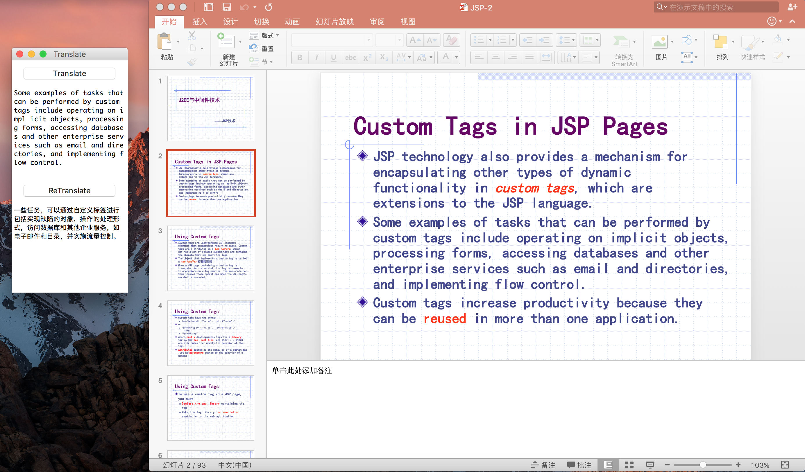
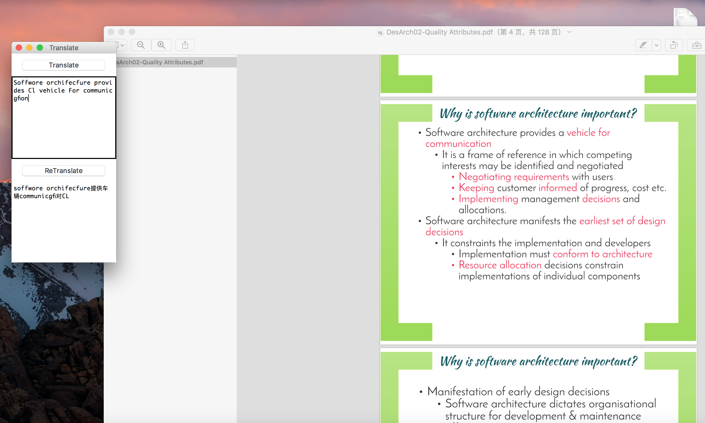
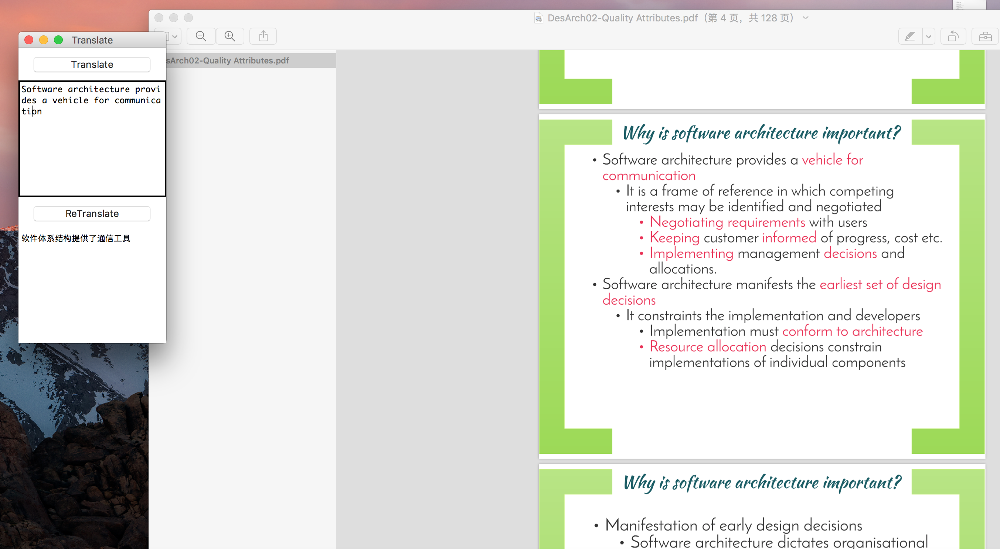

# ScreenTranslator

只是一个英语渣渣才会使用的小工具，英语大神请绕步……

超级low的翻译小工具，和截图软件相配合使用（比如QQ截图功能）

功能就是把剪贴板中的图片上的英语翻译为中文

### 工具展示

### 动机

啊啊啊 体系结构老师逼的……上课中文授课时不时蹦出几个听不懂的英文单词……一脸懵逼，看PPT理解下吧

他的PPT全是图片！！！

图片上面的英文无法复制出来翻译啊！！！

想搜怕错过课程内容，不搜又不知道他讲的是啥……

于是乎就想找个可以提取英文翻译的软件……找了半天要么只有提取文本，要么只有翻译……

大不了自己撸 哼

### 下载安装

直接下载Main.py就可以了……

由于最近百度更新了api接口，之前的免费的不可以再使用，如果使用之前的百度翻译可以自己先去申请一个百度翻译开发者账号 每个月可以免费翻译200万字，如果比较懒，而且只是翻译单词或者一个句子的话可以将getText方法替换为 `youdaoTranslator.py` 中的getText方法

### 配置要求

* Python3.6
* tkinter库
* PIL库
* requests库

### 快速开始

pip 安装好上述库后
直接 python3 /Path/To/Main.py/File

### 后记

上面项目展示用的是J2EE的课件……为什么不用体系结构的课件呢？

!!!他用图片不说……用的英文字体还那么奇葩……难过……

之后进行了改进

提取的英文可以修改 点击ReTranslate重新翻译吧……

学好英语很重要！！！

### License

MIT
